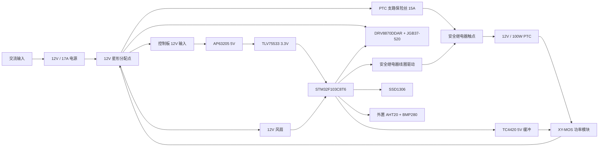

# STM32 耗材烘干机硬件设计与器材选型

## 1. 设计目标

本版硬件面向 12V 直流供电的 3D 打印耗材烘干机，保留当前 STM32F103C8T6 固件和接口，并集成 JGB37-520 两线直流减速电机驱动。

主要负载如下：

| 负载 | 规格 | 设计电流 |
|---|---:|---:|
| PTC 加热器 | 12V / 100W | 额定约 8.33A，冷态按 10A 预估 |
| 循环风扇 | Nidec D04R-12TH 26B，12V / 0.13A | 启动按 0.20A 预估 |
| 旋转电机 | JGB37-520，12V，两线无编码器 | 启动、正常和堵转电流必须按所购版本实测 |
| 控制板 | 5V 和 3.3V 负载 | 12V 输入侧按 0.20A 预留 |

设计原则：

1. PTC 的 8A 以上电流不经过 STM32 控制板。
2. 12V 电源负极作为唯一星形接地点，PTC、风扇、电机和控制板分别回到该点。
3. 软件控温之外增加独立硬件断热链路。
4. 温湿度模块通过独立插座引出，安装在回风区域，避开 PTC 直接热辐射。
5. 电机使用 DRV8870 限流和开环 PWM 调速；当前没有转速反馈或电子堵转检测。

## 2. 推荐系统架构



## 3. 核心器件选型

### 3.1 主控

推荐 `STM32F103C8T6TR`，LQFP48 封装。

选择理由：

- 与当前工程和 HAL 驱动完全一致，不需要迁移固件。
- 具备两路 I2C、SPI、多个定时器和足够 GPIO。
- 当前 OLED、传感器、Flash、风扇状态和 XY-MOS 引脚可保持不变。
- PA0、PA2 已分配给电机驱动，PA3 可用于安全继电器，PA9、PA10 保持预留。

### 3.2 电源

系统电源推荐 `MEAN WELL LRS-200-12`：

- 输出 12V / 17A / 204W。
- 100W PTC 的额定电流约 8.33A。
- 按 PTC 冷态 1.2 倍、风扇启动、电机堵转和 25% 系统余量估算，建议电源能力不低于约 14A。
- 17A 电源能够留出启动、电机堵转和后续扩展余量。

`LRS-200-12` 的交流端子外露，必须安装在接地金属外壳内，配置带保险丝的 IEC 输入座、保护地和应力释放。若不具备交流接线条件，应改用具有认证、全封闭的 12V / 15A 以上桌面电源。

控制板电源采用两级结构：

| 电源轨 | 推荐器件 | 用途 |
|---|---|---|
| 12V 转 5V | AP63205WU-7 | XY-MOS 控制缓冲及扩展接口 |
| 5V 转 3.3V | TLV75533PDBVR | STM32、OLED、AHT20/BMP280、W25Q32 |

AP63205 外围按官方推荐值设计：4.7uH 电感、10uF 输入、2 x 22uF 输出和 100nF BST 电容。

### 3.3 PTC 加热控制

现有 XY-MOS 模块继续作为 PTC 功率开关，但采购或验收时必须满足：

- 12V 下连续通过 10A。
- 控制输入能够可靠识别 5V。
- 端子和导线额定电流不低于 15A。
- 10A 连续运行 30 分钟时，无端子软化、异常气味或不可接受的温升。

PB8 不直接连接 XY-MOS 输入，增加 `TC4420EOA` 非反相缓冲：

```text
PB8/TIM4_CH3 -> 1k 串联 -> TC4420 输入
TC4420 输入 -> 100k 下拉 -> GND
TC4420 VDD -> 5V
TC4420 OUT -> 33R -> XY-MOS IN
XY-MOS GND -> 星形 GND
```

这样可获得接近 5V 的稳定控制高电平，并通过 100k 下拉保证 STM32 复位、掉电或引脚高阻时加热关闭。现有 10Hz PTC PWM 可以继续使用。

建议增加独立安全链：

```text
12V -> PTC 支路保险丝 -> 安全继电器常开触点 -> PTC -> XY-MOS -> GND
12V -> 常闭温控器 -> 安全继电器线圈 -> AO3400A -> GND
```

安全继电器只在任务开始和结束时动作，不参与 PWM。常闭温控器应安装在具有代表性的热风出口位置。温控器动作点可先按 80°C 试制，最终值必须根据实机最高正常温度、安装位置和外壳耐温测试确定。

### 3.4 减速电机

已选用 `JGB37-520` 12V 两线有刷直流减速电机，不带编码器：

| 项目 | 设计要求 |
|---|---|
| 电机 | JGB37-520 |
| 类型 | 12V 有刷直流金属减速电机，两根电机线，无编码器 |
| 输出转速 | 以所购电机铭牌或商品规格为准 |
| 调速方式 | DRV8870 输出 20kHz PWM，开环调速 |
| 转向 | 由 OUT1、OUT2 极性决定，反接两根电机线可改变默认方向 |
| 电流 | 装机后实测空载、带载启动、稳定运行和短时堵转电流 |

`JGB37-520` 是一个包含多种减速比和绕组的系列名称，仅凭型号不能确定输出转速和堵转电流。因为当前电机没有编码器，控制器无法测量实际转速，也不能通过脉冲消失判断卡料；软件只能按设定占空比和运行时间驱动。机械结构应增加柔性联轴器、打滑机构或扭矩限制结构，避免卡料后长期堵转。

### 3.5 直流电机驱动

推荐 `DRV8870DDAR`，DDA 8 引脚 PowerPAD 封装：

- 工作电压 6.5V 至 45V，可直接使用 12V 总线。
- 单路全桥，可正转、反转、刹车和 PWM 调速。
- 峰值驱动能力 3.6A。
- 集成欠压、过流和过温保护。
- 通过 VREF 和 ISEN 外部采样电阻调节电流。
- IN1、IN2 可直接接受 STM32 的 3.3V 逻辑电平。
- 芯片没有独立故障输出脚，当前电机也没有编码器，因此本版不能直接判断电机是否真正旋转或已经堵转。

DRV8870DDAR 引脚连接：

| DRV8870 引脚 | 网络 | 连接 |
|---:|---|---|
| 1 GND | MOTOR_GND | 逻辑地，连接驱动器附近的功率地汇合点 |
| 2 IN2 | MOTOR_IN2 | PA2 GPIO 输出，保留 TIM2_CH3 反转 PWM 能力 |
| 3 IN1 | MOTOR_IN1 | PA0/TIM2_CH1，可输出正转 PWM |
| 4 VREF | MOTOR_VREF | 3V3 经 1kΩ 接入，VREF 端放置 100nF 到 GND |
| 5 VM | 12V_MOTOR | 12V 电机支路，紧贴放置 100nF 和 100uF/25V |
| 6 OUT1 | MOTOR_OUT1 | 接 J2-1 和电机线 A |
| 7 ISEN | MOTOR_ISEN | 经 `R_ISEN`、1%、至少 1W 低感采样电阻接 MOTOR_GND，阻值按实测电流选择 |
| 8 OUT2 | MOTOR_OUT2 | 接 J2-2 和电机线 B |
| PowerPAD | MOTOR_GND | 焊接到大面积地铜，并使用多颗散热过孔 |

DRV8870 的限流关系为：

```text
ITRIP = VREF / (AV × RISEN)
AV_typ = 10
```

在 `VREF=3.3V` 时可按下表选择首版采样电阻：

| R_ISEN | 典型 ITRIP | 适用条件 |
|---:|---:|---|
| 0.30Ω / 1W | 1.10A | 实测带载启动电流低于约 1A |
| 0.22Ω / 1W | 1.50A | 推荐作为未知版本的首轮调试值 |
| 0.15Ω / 2W | 2.20A | 仅在确认电机需要较大启动电流且 PCB 散热合格后使用 |

原理图中将 `R_ISEN` 标为 `0.22Ω/1W, TBD`，PCB 使用 2512 或更大封装。先断开机械负载，以限流电源测试电机，再根据实测带载启动电流冻结阻值。若 0.22Ω 时电机无法可靠启动，不应直接短接 ISEN 电阻，而应确认卡阻、电源压降和真实启动电流后再调整。采样电阻必须靠近 ISEN，使用宽铜连接；采样电阻地端与 PowerPAD、GND 在驱动器附近汇合，不要让电机电流经过 MCU 地线。

控制状态：

| IN1 | IN2 | 电机状态 |
|---:|---:|---|
| 0 | 0 | 滑行停止，约 1ms 后进入休眠 |
| 1 | 0 | 正转 |
| 0 | 1 | 反转 |
| 1 | 1 | 刹车 |

正转调速时可令 `IN2=0`、`IN1=20kHz PWM`；反转调速时可令 `IN1=0`、`IN2=20kHz PWM`。

当前固件采用正转模式：PTC实际加热时IN1输出20kHz PWM、IN2保持低电平；等待、保持、只吹风、任务停止或锁存故障时两路均为低电平。默认占空比为100%。

DRV8870 的 VM 引脚附近放置 100nF 陶瓷电容和至少 100uF/25V 低 ESR 电解电容。PowerPAD 必须连接大面积地铜并布置散热过孔。电机端子处并联 100nF 抑制电容，电机线与 I2C 传感器线分开走线。

不推荐在 12V 总线上使用 DRV8833。其推荐电机电源上限为 10.8V，与本系统 12V 供电不匹配。

### 3.6 外置温湿度模块

AHT20 + BMP280 模块使用独立 I2C2：

| 信号 | STM32 | 接口 |
|---|---|---|
| 3V3 | 3.3V | J5-1 |
| GND | GND | J5-2 |
| SCL | PB10 / I2C2_SCL | J5-3 |
| SDA | PB11 / I2C2_SDA | J5-4 |

主板侧预留 4.7kΩ 上拉到 3.3V，并将上拉电阻做成可不装配置，避免与模块自带上拉并联后阻值过低。SCL、SDA 各串联 33Ω，连接器旁预留低电容 ESD 保护。

本版目标为 100kHz I2C、线长不超过 30cm。传感器应放在循环回风区域，不得贴近 PTC、风扇电机或箱壁。若线长超过 30cm 或经过强电流线束，应改用屏蔽双绞线并评估 PCA9615 一类差分 I2C 延长方案。

### 3.7 风扇接口

Nidec D04R-12TH 26B 直接使用 12V 供电。现有第三线按实测作为锁转状态使用：

```text
红线 -> 12V
黑线 -> 星形 GND
黄线 -> 1k 串联 -> PA8
PA8 -> 4.7k 上拉 -> 3.3V
```

当前逻辑为低电平表示 `RUN`，高电平持续超过设定时间表示 `STOP`。该信号用于风扇安全联锁，不作为精确转速信号。

## 4. 新增引脚分配

现有引脚保持不变，电机引脚已经在固件中启用，安全链引脚仍为规划项：

| 功能 | STM32 引脚 | 外设 | 说明 |
|---|---|---|---|
| 电机 IN1 | PA0 | TIM2_CH1 | 20kHz PWM |
| 电机 IN2 | PA2 | GPIO 输出 | 当前保持低电平；保留 TIM2_CH3 反转能力 |
| 加热安全使能 | PA3 | GPIO 输出 | 只控制安全继电器线圈 |

JGB37-520 的两根电机线按下表连接。该类电机通常没有统一线色定义，应按实际端子确认：

| 电机端子 | 连接 |
|---|---|
| 电机线 A | J2-1 / DRV8870 OUT1 |
| 电机线 B | J2-2 / DRV8870 OUT2 |

如果正转方向与机械结构要求相反，可交换两根电机线，或在软件中交换 IN1、IN2 的控制逻辑。PA9、PA10 保持悬空并标记 NC，不安装编码器插座和 10kΩ/20kΩ 分压电阻。

## 5. 接口定义

| 接口 | 建议连接器 | 引脚定义 |
|---|---|---|
| J1 控制板电源 | 2P 5.08mm 可插拔端子，额定不低于 5A | 1:12V，2:GND |
| J2 电机 | 2P 5.08mm 端子 | 1:OUT1，2:OUT2 |
| J4 风扇 | JST-XH 3P | 1:12V，2:GND，3:LOCK |
| J5 外置传感器 | JST-XH 4P | 1:3V3，2:GND，3:SCL2，4:SDA2 |
| J6 OLED | JST-XH 4P | 1:3V3，2:GND，3:SCL1，4:SDA1 |
| J7 旋转编码器 | JST-XH 5P | 1:3V3，2:GND，3:S1，4:S2，5:KEY |
| J8 XY-MOS 控制 | JST-XH 2P | 1:CTRL_5V，2:GND |
| J9 SWD | 2 x 5P、1.27mm | SWDIO、SWCLK、NRST、3V3、GND |
| J10 安全继电器线圈 | JST-XH 2P | 1:12V_THERM，2:RELAY_LOW |

PTC 主电流不得使用 JST-XH 或普通小型 KF301 克隆端子。PTC 支路使用额定 15A 以上的压接端子、保险丝座和线束。

## 6. 保险丝、线材与接地

试制初始值：

| 位置 | 初始建议 | 说明 |
|---|---:|---|
| 12V 主支路 | 15A ATO/ATC | 保护总线和主线束 |
| PTC 支路 | 15A ATO/ATC | 最终按实测冷态电流调整 |
| 控制板/电机支路 | 2A 慢熔，最终按实测调整 | 与所选 R_ISEN 和带载启动电流配合 |

线材建议：

- 电源到星形分配点：铜线不小于 2.5mm²。
- PTC 支路：铜线不小于 1.5mm²，较长或环境温度较高时使用 2.5mm²。
- 电机支路：0.5 至 0.75mm²。
- 传感器和控制线：0.14 至 0.25mm²，远离 PTC 和电机线。

接地必须采用星形结构：

```text
12V 电源负极
├── XY-MOS 功率地
├── 风扇地
├── DRV8870 功率地
└── 控制板地
```

不得让 PTC、风扇或电机电流经过开发板地线，也不得用风扇地线串接控制板。XY-MOS 若不是隔离输入，控制地必须和系统地连接；若连接后出现大电流或冒烟，应立即断电并重新确认模块的电源端、负载端和信号端，不能通过悬空控制地规避问题。

## 7. PCB 布局要求

1. 控制板按 12V 功率区、5V/3.3V 电源区、电机驱动区、MCU 数字区和 I2C 传感区分区。
2. PTC 主电流不进入控制板，PCB 仅保留 XY-MOS 控制接口。
3. DRV8870 的 VM、OUT1、OUT2、ISEN 和采样电阻使用宽铜皮，PowerPAD 下方布置散热过孔。
4. 100uF 电机储能电容和 100nF 旁路电容紧贴 DRV8870。
5. AP63205 的开关回路面积尽可能小，SW 铜皮不要经过 MCU、晶振或 I2C 区域。
6. 每个 STM32 VDD 引脚附近放置 100nF，VDDA 经磁珠供电并配置 100nF + 1uF。
7. I2C 接口远离电机输出、PTC 线束和继电器触点。
8. 2 层 1oz PCB 可用于本方案，因为 PTC 大电流在板外；若未来将 PTC 开关集成上板，应重新按 2oz 铜厚、温升和端子额定值设计。

## 8. 样机验收

| 测试 | 方法 | 通过条件 |
|---|---|---|
| 空载上电 | 不接 PTC、电机和风扇 | 5V、3.3V 正常，PB8、PA0、PA2 和安全继电器默认为关闭 |
| XY-MOS 控制 | 示波器测 J8 | 低电平小于 0.4V，高电平大于 4.5V，10Hz PWM 正确 |
| 电机启动 | 逐步增加 PWM | 可靠启动，无驱动器过热或电源复位 |
| 电机限流 | 短时机械限位，小于 1 秒 | 电流受限在所选 R_ISEN 对应值附近，停止后能恢复 |
| 风扇联锁 | 任务中断开风扇 | 在固件设定延时后 PTC、电机和安全继电器关闭 |
| 传感器重连 | 运行中拔插 J5 | 故障时禁止加热，重连后恢复数据 |
| 额定加热 | 100W 连续运行 30 分钟 | 端子、线束和 XY-MOS 无异常，温升满足器件与外壳要求 |
| 独立过温 | 加热传感器或模拟超温 | 无需 STM32 指令即可释放安全继电器 |
| 断电状态 | 任意运行状态直接断电 | PTC、继电器和电机均回到关闭状态 |

## 9. 定型前必须实测的参数

以下项目不能只依据网店标称值：

- 100W PTC 的冷态启动电流和稳态电流。
- XY-MOS 在 10A 下的压降、端子温升和 MOSFET 温升。
- 烘干箱内最高正常空气温度、PTC 表面温度和安全温控器安装点温度。
- 选定减速电机带实际料盘时的启动电流、正常电流和卡料电流。
- 风道中最不利位置的温度均匀性。

完成这些实测后，再冻结保险丝值、温控器动作点、热熔断器温度等级和最终线径。

## 10. 官方资料

- STM32F103C8: https://www.st.com/en/microcontrollers-microprocessors/stm32f103c8
- DRV8870: https://www.ti.com/lit/ds/symlink/drv8870.pdf
- DRV8833: https://www.ti.com/product/DRV8833
- AP63205: https://www.diodes.com/datasheet/download/AP63200-AP63201-AP63203-AP63205.pdf
- TLV75533: https://www.ti.com/product/TLV755P
- TC4420: https://www.microchip.com/en-us/product/TC4420
- AHT20: https://www.aosong.com/userfiles/files/media/Data%20Sheet%20AHT20.pdf
- BMP280: https://www.bosch-sensortec.com/media/boschsensortec/downloads/datasheets/bst-bmp280-ds001.pdf
- LRS-200-12: https://www.meanwell.com/Upload/PDF/LRS-200/LRS-200-SPEC.PDF
- W25Q32JV: https://www.winbond.com/hq/support/documentation/
