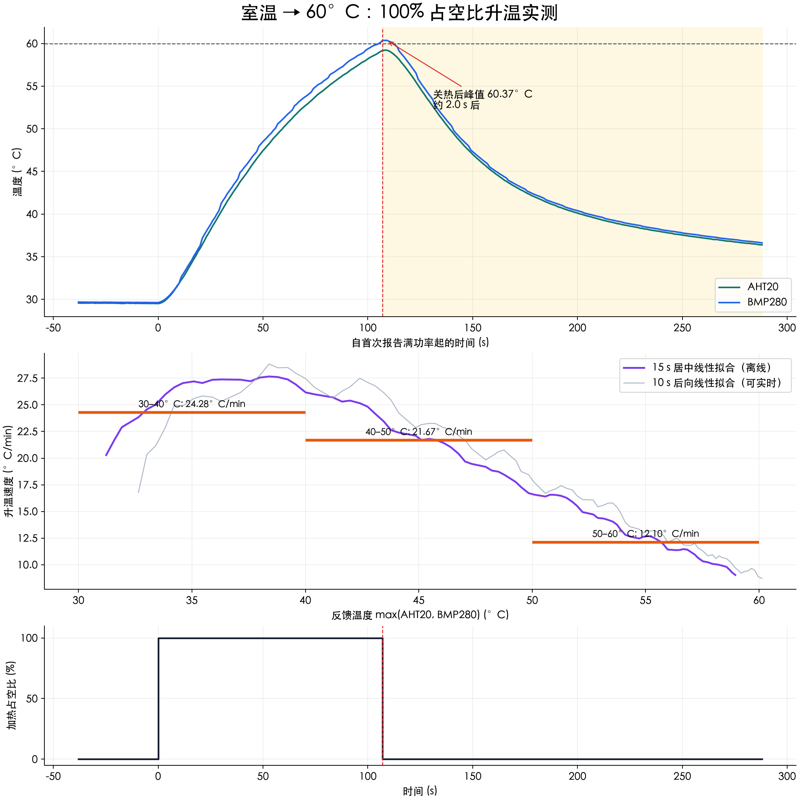

# 室温至 60°C 满占空比采样（2026-09-16）

本次测量已完成并确认停止。起始 30 秒静置反馈温度平均 29.646°C。
室温起点按箱内静置示值记录，未独立测量环境温度或确认耗材内部热平衡。
临时 STM32 固件保持 1000/1000 输出，任一传感器达到 60°C 时本地锁定加热为零；
随后继续保持电机运转 180 秒记录余热，结束时停止电机。风扇为独立持续运行。
保留传感器、风扇、75°C 过温保护和通信租约，另有 900 秒本地加热时限。
原 PID 源码和参数未修改。固件恢复情况另见 restoration.json。

## 实测升温速度

时间基准使用 STM32 tick，温度使用两传感器较高值；跨温度边界时间在相邻样本间线性插值。
首次遥测报告满功率至首次达到 60°C 约 105.24 秒。
由于原遥测在控制更新前生成，输出切换时间只能定位到相邻约 1 秒帧区间，不能解读为毫秒级精度。

| 温度区间 | 耗时 (s) | 平均速度 (°C/min) | 平均速度 (°C/s) |
|---|---:|---:|---:|
| 30–40°C | 24.71 | 24.278 | 0.40464 |
| 40–50°C | 27.69 | 21.669 | 0.36116 |
| 50–60°C | 49.57 | 12.104 | 0.20173 |
| 30–35°C | 13.57 | 22.110 | 0.36850 |
| 35–40°C | 11.14 | 26.918 | 0.44864 |
| 40–45°C | 11.56 | 25.948 | 0.43247 |
| 45–50°C | 16.13 | 18.602 | 0.31004 |
| 50–55°C | 19.74 | 15.195 | 0.25325 |
| 55–60°C | 29.83 | 10.058 | 0.16764 |

## 关热后余热

- 最后满功率帧温度：60.13°C；首个零输出帧：60.36°C。
- 零输出后峰值：60.37°C，约在首个零输出帧之后 2.00 秒。
- 相对首个零输出帧继续升高 0.01°C；相对 60°C 高 0.37°C。
- 关热前 10 秒后向拟合升温速度：0.14509°C/s。
- 本地控制在发送遥测后执行，因此 60.13°C 这一帧仍报告满功率，随后才触发关热。
  相对该触发样本的后续温升约 0.24°C；除以关热前速度约为
  1.65 秒，仅可作为本次工况的粗略预测量参考。
  不应把首个零输出帧之后的 0.01°C 当成全部余热，也不能据 1 秒采样率标定亚秒级时间常数。

## 数据质量及后续使用

- 合并后 327 个样本，其中 327 个来自 ESP32 原始逐秒历史；HTTP 轮询保存了 319 个样本。
- 最大相邻采样间隔 1.002 秒。加热段所有输出均为 1000，关热后均为 0，未记录故障。
- 最大双传感器温差 1.23°C；本次为传感器示值，不代表耗材内部温度。
- `analyzed_samples.csv` 提供逐秒温度、输出、离线居中 15 秒斜率、可实时后向 10 秒斜率。
- `rate_lookup_1c.csv` 提供每 1°C 的实测通过时间及平均速度；起始 15 秒相关区间标为初始过渡。
- 实测原样保留，不强制拟合成单调下降。初始传热滞后可能让最初几秒先加速。
- 本次只测到约 60°C 的满占空比轨迹和断热余热；不能直接推广到不同装载、环境、部分功率或掉温恢复。
- 后续第三条可用升温速度表描述温度相关响应，用余热数据校准提前减功率的预测量；
  仍需在不同温度进行减功率/断热试验，以及热机掉温恢复验证。
- 本实验测量的是 100% PWM 占空比，未测电压、电流，不能宣称 PTC 始终以恒定瓦数加热。

