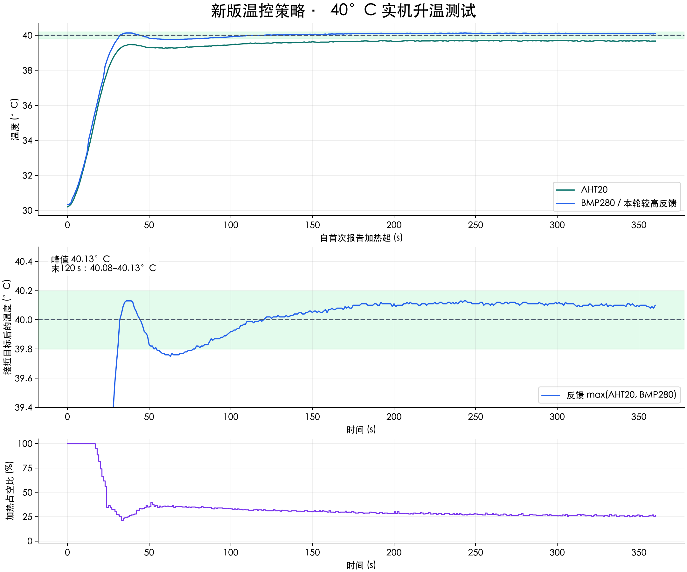
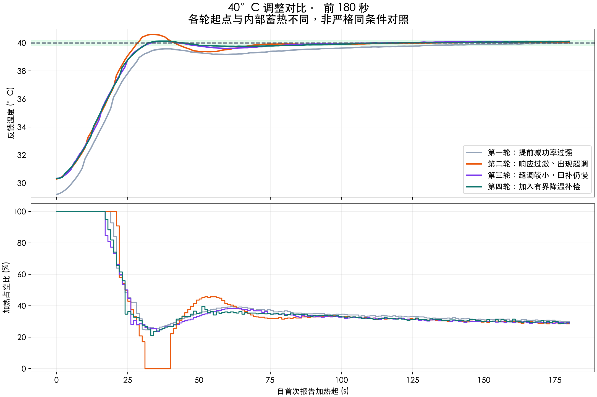

# 40°C 温控策略调整与实测（2026-09-16）

最终固件已烧录并校验，设备保持 STOP、加热和电机关闭，运行时目标 40°C（未写入目标设置 Flash）。
最终固件 SHA256：`18d845f37956395855b39537d52da9a6f73314cb300f61b247e36e53bef97490`。

## 现象与诊断

满占空比时，温度升高后升温速度变慢属于实测对象特性；此前的近目标回落则还包含控制器过早削减功率。
第一轮升至约 39.58°C 时输出已经降至 27.4%，随后回到 39.18°C。原先以较早热机试验的
22.67% 作为保温初值，在本轮快速升温时偏低；预测、微分与额外蓄热扣减又叠加，造成加热不足。
第二轮显著减弱制动、提高比例后约 29 秒达到目标，但峰值 40.60°C，触发零输出后再次回落，故停止并重调。
第一轮最后的另一段快速降温发生时输出正在回升，随后运行状态变为停止，不能全部归因于 PID 减功率。
第三轮降低初始超调，但到温后仍从约 40.12°C 回落到 39.61°C；当温度掉头时仅靠误差增加功率仍偏慢。
第四轮加入有上限的降温补偿，避免把补偿完全禁用，也避免大幅跌温时产生无限制的微分助推。

## 最终策略

- 基准参数 **Kp=200、Ki=2、Kd=180、积分分离阈值=2°C**；输出单位 0–1000，时间单位秒。
- 40°C 基础功率初值约 30%，用积分作 ±25 个百分点的修正；其它目标的基础功率为估计值。
- 小幅调高目标保留已有积分修正和温度趋势；调低目标清除正向积分修正；停机、故障、湿度达标仍复位。
- 短时快速掉温抑制额外积分 12 秒；只有温差小于等于 2°C、变化率不超过 0.1°C/s 时修正积分。
  正在接近预测目标时不继续积累正积分，输出饱和时使用条件积分。
- 使用满占空比实测速率表进行有界增益调整。过滤后的正升温速度与近期输出给出 1.7–2.2 秒预测量，
  取消独立的额外蓄热温升扣减。接近目标且温度下降时，按实测升温速率估算回补量，最多额外 10 个百分点；
  温差超过 2°C 或高于目标 0.2°C 时不使用这项补偿，防止大幅扰动时叠加过量加热。
- 温度超过目标 0.30°C 时暂时关闭加热；既有风扇、传感器、75°C 锁存过温和远程租约保护保留。
- PID 严格随新传感器样本推进；只改目标时不重复积分或更新温度微分。

## 四轮实测

| 轮次 | 静置起点 °C | 首次40°C耗时 s | 运行期间峰值 °C | 前120秒最大回落 °C | 完整性 |
|---|---:|---:|---:|---:|---|
| trial01 | 29.23 | 182.0 | 40.12 | 0.40 | 中途停止 |
| trial02 | 30.35 | 28.5 | 40.60 | 1.23 | 中途停止 |
| trial03 | 30.44 | 33.2 | 40.15 | 0.51 | 中途停止 |
| trial04 | 30.43 | 32.0 | 40.13 | 0.38 | 完成360秒 |

最大回落定义为前 120 秒内“此前最高温减当前温度”的最大值，包含首次到温后的回落。
各轮起点、内部蓄热和停止时机不同，时间对比只作本次调参参考，不是严格同条件性能倍数。

最终轮持续 360.0 秒，保存 360 个设备原始样本，最大帧间隔 2.001 秒。
约第 135–137 秒有一处约 2 秒的采样间隔；不补造缺失帧，峰值和最后 120 秒统计使用实际收到的样本。
峰值 40.13°C，最大超调 0.13°C。
首次到达 40°C 前的最大回落为 0.00°C；
前 120 秒含到温后的最大回落为 0.38°C，仍未完全消除。
最后 120 秒范围 40.08–40.13°C，
平均绝对误差 0.107°C，平均占空比 26.63%。
持续落在 ±0.2°C 带内且后续至少观察 120 秒的起始时刻：77.0 秒。

## 验证范围

控制逻辑测试覆盖目标小幅上调、下降目标、回温积分保持、饱和、无效时间间隔、重复传感器样本，
并在三种简化热模型中检查冷启动、小幅上调和扰动恢复。简化模型结果不替代实机验证。
已实测验证本轮 40°C 升温；尚未实机验证小幅上调、开盖掉温恢复及其它目标温度。
温度反馈为两传感器较高值，不是耗材内部温度或经过独立校准的真值。

测试固件附加 43°C 自动停止与 660 秒本地时限；测试结束后安装相同控制算法的正常固件，
正常安全保护保留，不保留仅用于本轮测试的时间/目标限制。
原始数据、完整参数源码快照、试验限时补丁、烧录校验日志保存在各 trial 目录。

